# Project 1: Design Journey

**For each milestone, complete only the sections that are labeled with that milestone.**

Be clear and concise in your writing. Bullets points are encouraged.

**Everything, including images, must be visible in Markdown Preview.** If it's not visible in Markdown Preview, then we won't grade it. We won't give you partial credit either. This is your warning.


## Existing Design, Planning, & Refined Design (Milestone 1)

### Existing Site: The Site (Milestone 1)
> What is your existing site about? Tell us about it.

My existing site is intended to assist Ithaca Apple Fest attendees find, learn about foods at the festival and order food from the stands at the fair.

> How and where did you create this site?

I created this site in HTML for INFO 1300. The website is entirely static.

> Is this site designed for desktop, mobile devices or both?

The site is designed for both desktop and mobile devices.


### Existing Site: Audience (Milestone 1)
> Who is your _existing_ site's audience?
> Briefly explain who the intended audience(s) is for your website. Be specific and justify why this audience is appropriate for your site. Remember, you may not be the audience.

The intended audience will mainly include 18-25 y.o. Cornell students that hope to spend a few hours in the morning/afternoon exploring the activities/festivities offered at Apple Fest. Some of these users may also include tourists that happen to be visiting Ithaca. My audience will most likely arrive in groups of 2-3 friends.

I expect my audience will not consist of local Ithacans that are already familiar with the food offerings at the festival. Therefore they would not be familiar with:

  - local festival foods
  - popular stands
  - size of the festival (the number of people and the physical span of the fest)
  - distance between stands of interest

Since my audience will mostly consist of students, I also would expect that these users would not have much time to spend at the festival (due to homeworks/exams/their studies) and would thusly be highly interested in maximizing their activities in a small amount of time. My audience will also most likely be traveling on foot and public transportation.

### Existing Site: Audience Needs (Milestone 1)
> Document your existing site's audience's needs. (These should be informed by user research. Not assumptions.)
> List each need below. There is no specific number of needs required for this, but you need enough to do the job.
> You may copy these from your previous project. However, I would encourage you to refine them.

Need/Want 1: Hours/Time of the Event
- **Needs and Wants**
  - My audience needs a consistent way of getting to know when the festival starts/ends
- **Design Ideas and Choices**
  - I can accomplish this by displaying the time/day of the event and when the event ends
- **Rationale & Additional Notes**
  - This is necessary because my audiences seem to have various ways of finding out when the event runs to, and some have even missed the festival due to a lack of consistent consensus over the time and date of the festival

Need/Want 2: Location of Popular Foods
- **Needs and Wants**
  - My audience would be interested in knowing what stands are popular
- **Design Ideas and Choices**
  - To do this I would label stands that are well-known/recommended in previous festivals from Ithaca News reports

  - I could also have a page that summarizes and links Ithaca News/yelp recommendations linked to each food stand
- **Rationale & Additional Notes**
  - I know that this is necessary because my audience is here to get to have a good time with friends, therefore having a recommended locations would make it easier for my audeince to have a good time.


Need/Want 3: What stands are availible/where
- **Needs and Wants**
  - My audience have different preferences in food, so they would be interested in finding stands that offer their favorite foods
- **Design Ideas and Choices**
  - I can meet those needs by putting a map on my website
  - To do this I would have a page that contains each stand and their place on the maps
  - I will also specify what food each stands provides
- **Rationale & Additional Notes**
  - Since my audience has different tastes, I think it would be important to cater towards that and order the stands by type


### Existing Site: Design/Sketches (Milestone 1)
> Sketch your existing site. Include these sketches here.
> DO NOT COPY SKETCHES FROM THE ORIGINAL ASSIGNMENT!
> Create new sketches here. This is part of the design process to get you thinking about the strengths/weaknesses of the current design.
> Provide a brief explanation _underneath_ each sketch.

**Desktop View**

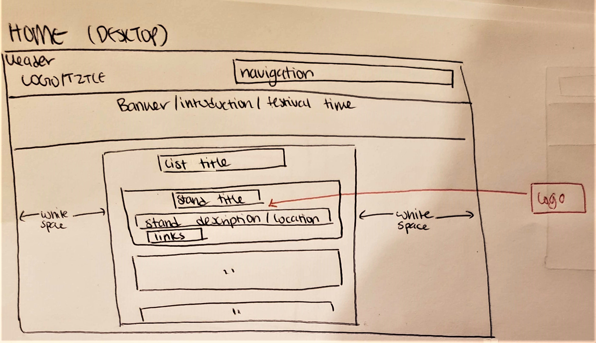

Home page desktop view.

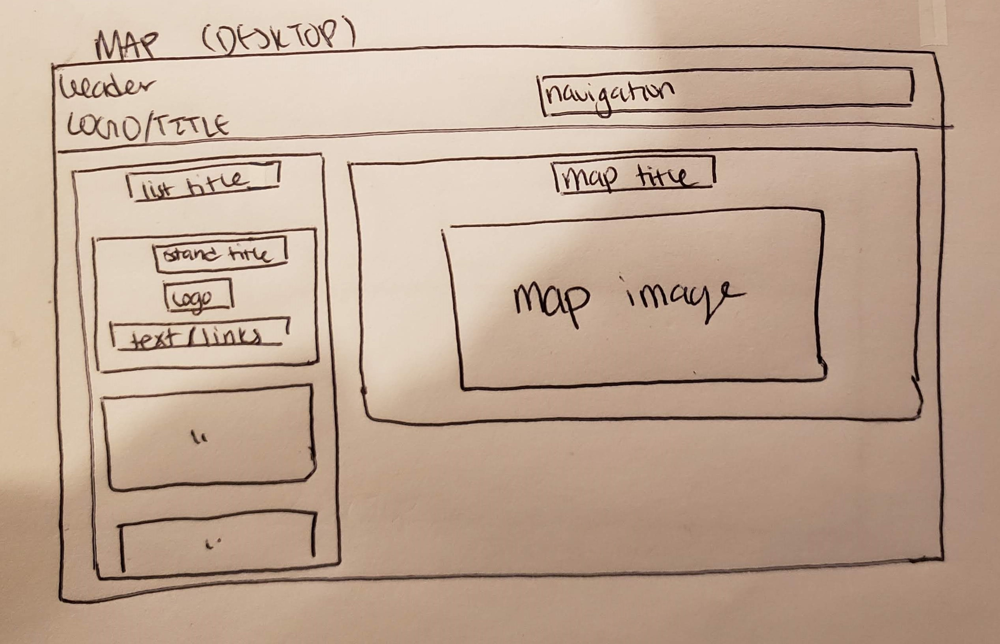

Map page desktop view

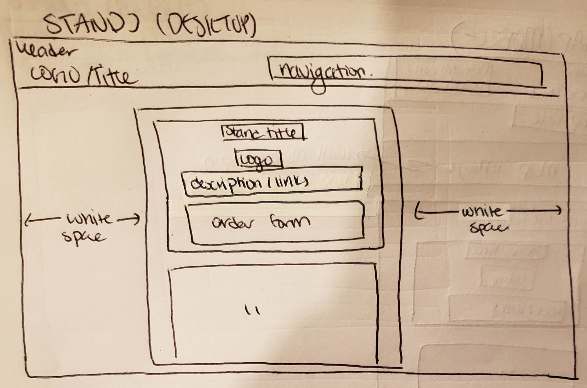

Stands page desktop view

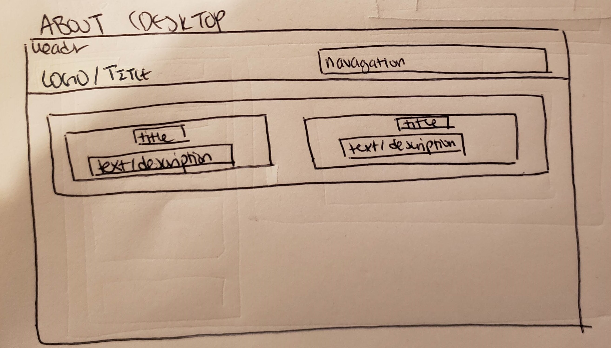

About page desktop view

**Mobile View**

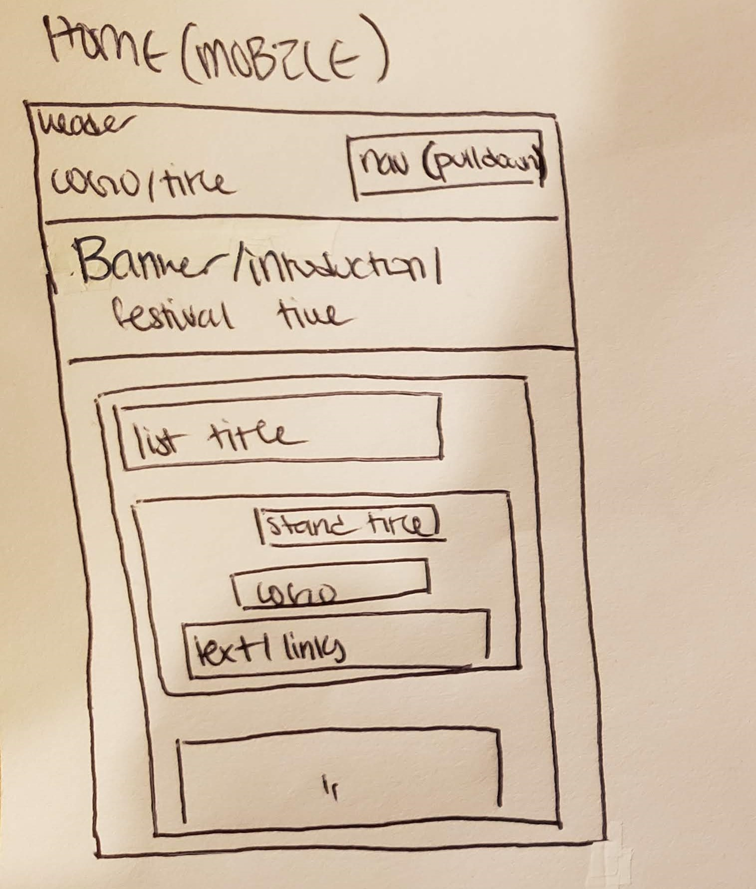

Home page mobile view

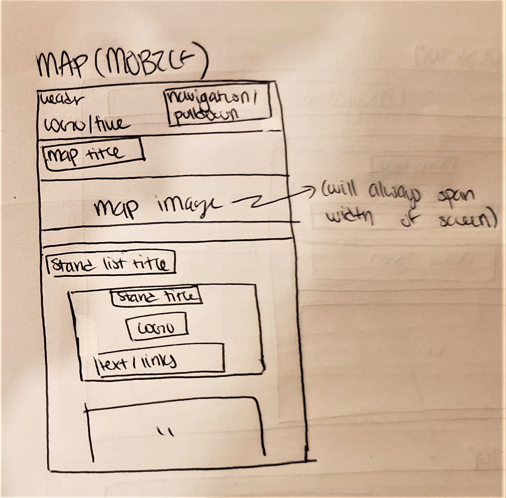

Map page mobile view

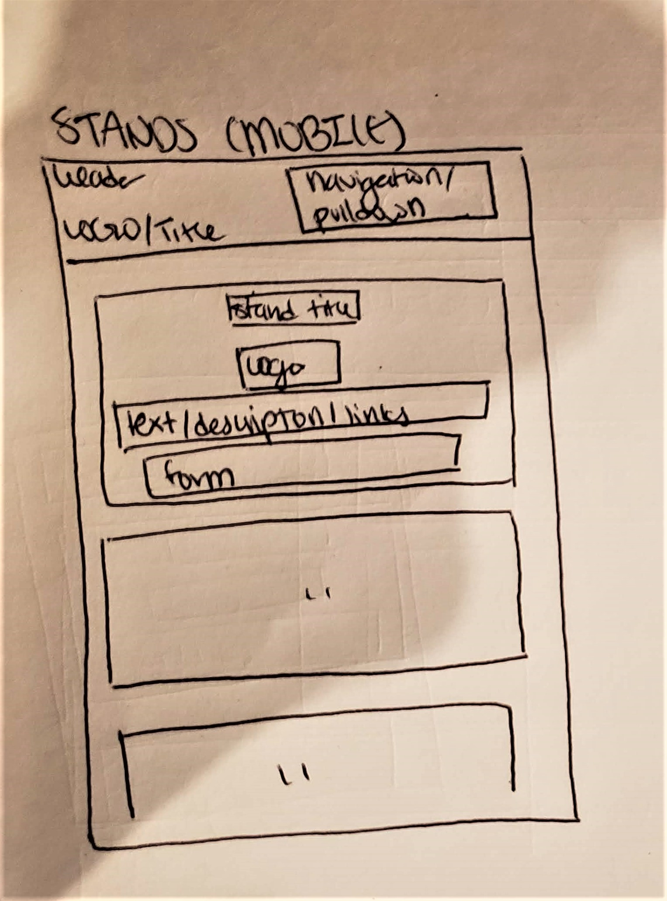

Stands page mobile view

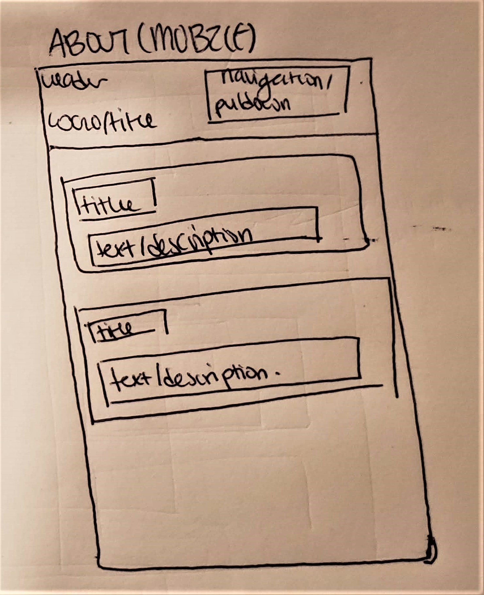

About page mobile view


### Refined Site: Persona (Milestone 1)
> Use the needs your identified above from user research, to develop a persona of your site's audience.
> Your persona must have a name and a "depiction". This can be a photo of a face or a drawing, etc.
> There is no required format for the persona.
> You may type out the persona below with bullet points or include an image of the persona. Just make sure it's easy to read the persona when previewing markdown.

Persona's Name:  Maria

Factors that Influence Behavior:
- Has a lot of homework to do in addition to other academic commitments
- Does not have a car
- Lives on Campus
- Has not attended Apple Fest yet
- Attending festivities with friends.

Needs/Obstacles/Desires

- Needs: to know the location of events
- Needs: the time of the event
- Needs: to know the approximate wait times for each stand
- Obstacles: unfamiliar with walking distance/time between locations
- Obstacles: slow internet connection due to use of data
- Obstacles: No car, thus will be arriving via TCAT
- Wants: to know what stands are most popular to maximize the fun in their experience

### Refined Site: Content Organization/Navigation (Milestone 1)
> Identify the content that is necessary for your persona. **Refer to the persona by name.**
> List the content here. Label the content as "(new)" if it's new to the existing site.
> **Don't forget to include the form.**

- Hours/Time of the Event
- Location of Popular Foods
- What stands are availible/where
- A way to view the menu of each stand
- Ways to cut time wasted waiting in line
- Time it takes to get to stand from tcat bust stop
- **(NEW)** Wait times for each stand


> Organize the content for the audience and identify possible pages for the content using card sorting.
> Document your card sorting by taking a photo and including it here.
> You are **required** to show the alternative organization you considered. (1 card sorting is not enough)

**Card Sort 1**

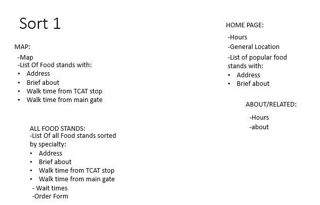

First Card sort

**Card Sort 2**

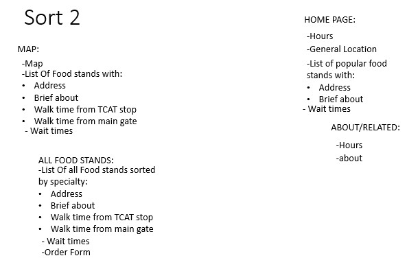

Second Card sort


> Explain your thought process behind the card sorting. **Refer to the persona by name in your explanation.**

**Card Sort 1 Rationale:**
- Each page (except for the about page) will have a list of food stands, however it will present the list in slightly different ways to satisfy Maria's different needs/wants/obstacles
- The Home page will feature the most popular food stand list to satisfies Maria's want to know the most popular stands to maximize her festival fun. It will also feature a blurb about the festival times to satisfy Maria's need to know the times of the event.
- The Map page will satisfy Maria's need to know about the relative distance/time it takes her to go from stand to stand. This will contain a complete list of the food stands, a picture of the map, walk times from TCAT stop for each stand as well as the approximate time it takes for Maria to walk from the main gate.
- The Food Stand page will satisfy Maria's want to maximize her time at the festival by allowing her to order directly from each shop, as well as contain all information of each food stand for her reference. The wait times for each shop is also placed the food stands page due to Maria's need to know approximate wait times that may be useful to her in deciding where to order from.

**Card Sort 2 Rationale:**
- Added wait times into the home page, map and food stands to accomodate for Maria's obstacle of limited Data/slow internet connection
  - If wait times was placed on all pages then Maria would not have to wait for each page to load as she searches for the wait times information.

> Lastly, list the pages that resulted from your final card sort (i.e. your site's navigation) and content for each page.

- Home Page
  - Wait times, navigation options
  - List of popular food stands with:
    - Address
    - Brief about
    - Wait time

- Food Stands Page
  - List Of all Food stands sorted by specialty each featuring:
    - Address
    - Brief about
    - Walk time from TCAT stop
    - Walk time from main gate
    - Wait time
    - Order form

- Map page
  - Map
  - List Of all Food stands each featuring:
    - Address
    - Brief about
    - Walk time from TCAT stop
    - Walk time from main gate
    - Wait time

- About Page
  - Hours
  - Brief About section

### Refined Site: Design (Milestone 1)
> Refine the design of your site to meet the needs of your users using your persona.
> Include sketches of each page of the refined design.
> Provide a brief explanation _underneath_ each sketch.
> Document your _entire_ design process. **Show your preliminary sketches and your final sketches.** **We want to see iteration!**
> Don't forget the form and confirmation page!
> **Refer to your persona by name in each explanation.**

**Desktop View**

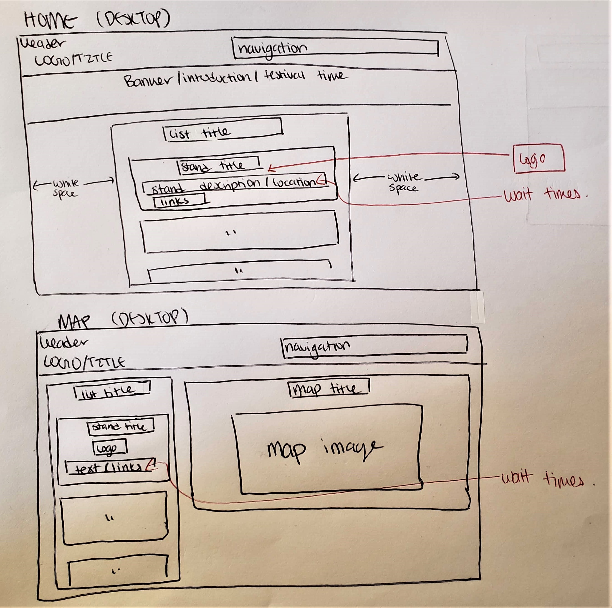

Home page Desktop (top) Map page Desktop(bottom). Added the wait times to each page to help make the wait times more accessible for Maria in case of slow internet connection. Also added wait time to original design to satisfy her need to optimize her festival experience! (see card sort rationale for specifics)

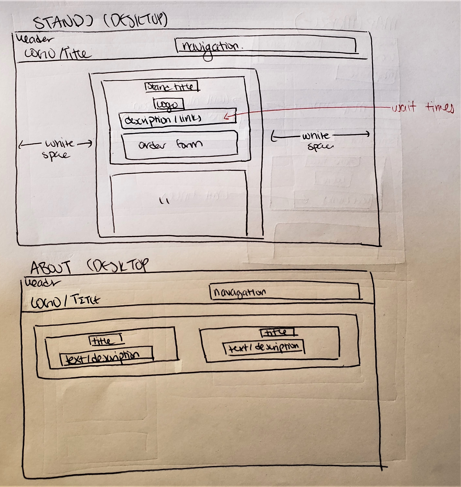

Stands page Desktop (top) About page Desktop(bottom). Added the wait times to stands to help make the wait times more accessible for Maria in case of slow internet connection. Also added wait time to original design to allow Maria to better decide on which stands to order based on how long it may take her to get it (see card sort rationale for specifics). No changes made to About page.

**Mobile View**

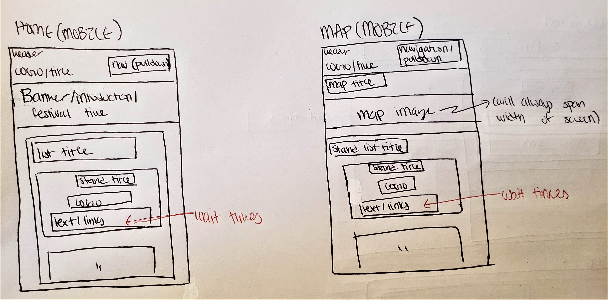

**SAME RATIONALE AS DESKTOP:** Home page Mobile (right) Map page Mobile(bottom). Added the wait times to each page to help make the wait times more accessible for Maria in case of slow internet connection. Also added wait time to original design to satisfy her need to optimize her festival experience! (see card sort rationale for specifics)

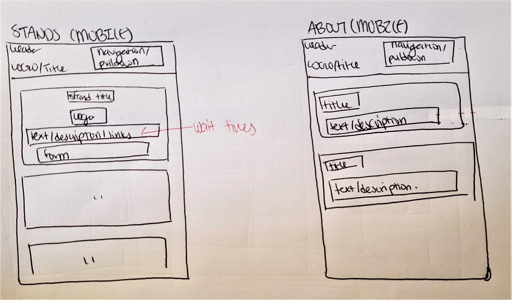

**SAME RATIONALE AS DESKTOP:** Stands page Mobile (right) About page Mobile(left). Added the wait times to stands to help make the wait times more accessible for Maria in case of slow internet connection. Also added wait time to original design to allow Maria to better decide on which stands to order based on how long it may take her to get it (see card sort rationale for specifics). No changes made to About page.

**Form View**


Form contains all information that a stand would need to know in order to complete a transaction. Since Maria will be making the order online, the transaction will be done via credit card input.


Form confirmation contains all information that Maria would need to know in order to pick up her order--this includes the time of pick up (which is important to know especially since Maria is interested in maximizing her time) and a clear message letting her know that her form has been submitted.


### Partial Plan (Milestone 1)
> Using your refined sketches, plan your site's partials.
> You may describe each partial or sketch it. It's up to you!

- Navigation Partial
  - As seen in sketches, will contain a logo/title and navigation links
  - A mobile and desktop version will exist for both
- Div Partials for each stand
  - since each stand section/box (see pictures) will be used many times (sometimes with slight variation from page to page) I plan on creating partials for every store I add
  - Mobile and desktop versions will be created for both
- Footer Partial
  - Since footer is on every page a footer partial would be needed


## Sticky Form (Milestone 2)

### Sticky Form Planning (Milestone 2)
> What controls do you need for your form?


- Phone Number (required): telephone number
- Food Item Quantity (required): number
- Payment Style (required): radio
    - credit-card #: text field
    - Name (required): text field
    - Expiration Date: date
    - Zip Code: text
    - CVC: password
- Order Confirmation page

> Plan out your feedback messages for your form. You may sketch (probably the easiest) or write it out.
> Use your persona. Refer to the persona by name. Explain how the feedback messages are usable for your persona.

#### Error Feedback:
- Phone Number (required): telephone number
  - *Message:* "Please provide your phone number."
- Food Item Quantity (required): number
  - *Message:* "Please order at least one item."
- Payment Style (required): radio
    - credit-card #: text field
      - *Message:* "Please provide a valid card number."
    - Name (required): text field
      - *Message:* "Please provide your name."
    - Expiration Date: date
      - *Message:* "Please provide the expiration date of your card."
    - Zip Code: text
      - *Message:* "Please enter your zip code."
    - CVC: password
      - *Message:* "Please provide your cvc number."

*Rationale:* Each message is usable by Maria because it provides feedback onto what issues she may be facing, and suggest a possible solution (i.e. provide a value for a certain input).


#### Confirmation Feedback:

*Message:* "Thank you for your order [NAME], We will call/text you at [PHONE NUMBER] when your order is ready at about [TIME]"

*Maria's Message:* "Thank you for your order Maria, We will call/text you at 555-555-555 when your order is ready at about 12:33PM"

*Rationale:* This message is usable by Maria because it allows her to know that her order went through, while also providing her instruction to better recieve her order.

> How does this form meet the needs of your persona?
> Refer to the persona by name.

My error messages meets the needs of Maria by providing her direct information regarding the problems with her form. This meets Maria's need for efficiency as she does not have much time to spend on deciphering long error feedback messages.

My confirmation feedback message meets the needs of Maria by providing her information regarding the approximation time of pickup, thus allowing Maria to maximize her time at the fair.

### Validation Code Plan (Milestone 2)
> Write out your pseudocode plan for handling the validation of the form.

```PHP
  /* FORM FEEDBACK: */
  When cash is selected:
    Hide credit card inputs and labels

  When credit is selected:
    Show credit card inputs and labels

  When user submits form:
    Let variable formValid be true

    if at least one food item quantity component has a value:
      Hide item quantity feedback
    else
      Show item quantity feedback
      Let variable formValid be false

    if phone number component is valid:
      Hide phone number feedback
    else
      Show phone number feedback
      Let variable formValid be false

    if payment method component is true check snippet for both cash and credit radio:
      Hide payment method feedback
    else
      Show payment method feedback
      Let variable formValid be false


  /* CREDIT CARD FEEDBACK: */
    if credit card radio is checked--check snippet for credit card radio:
      if credit card number component is not empty and contains number inputs--value snippet :
        Hide credit card number feedback
      else
        Show credit card number feedback
        Let variable formValid be false

      if first name component is not empty:
        Hide first name feedback
      else
        Show first name feedback
        Let variable formValid be false

      if last name component is not empty:
        Hide last name feedback
      else
        Show last name feedback
        Let variable formValid be false

      if expiration date component is not empty:
        Hide expiration date feedback
      else
        Show expiration date feedback
        Let variable formValid be false

      if zip code component is not empty and contains number inputs--value snippet :
        Hide zip code feedback
      else
        Show zip code feedback
        Let variable formValid be false

      if cvc component is not empty and contains number inputs:
        Hide cvc feedback
      else
        Show cvc feedback
        Let variable formValid be false

    If formValid is true send form data to server

```


## Complete & Polished Website (Final Submission)

### Routing (Final Submission)
> Plan your dynamic HTTP routing.
> List each route and the PHP file for each route.

| Route | PHP File                            |
| ----- | ----------------------------------- |
| /     | pages/index.php                     |
| /home  | pages/index.php                               |
| /stands  | pages/stands.php                                |
| /about     | pages/about.php                      |
| /map  | pages/map.php                                |
| ALL ELSE  | pages/404.php                               |


### Audience (Final Submission)
> Tell us how your final site meets the needs of the audience. Be specific here. Tell us how you tailored your design, content, etc. to make your website usable for your persona. Refer to the persona by name.

My audience is Maria, a busy Cornell undergraduate that is interested in attending Apple Fest with friends to enjoy the local foods and festivities at the event. My final site meets the needs of Maria by focusing on addressing the specific needs and obstacles that Maria has and may face at the festival. Amoung the many design considerations I made for Maria, some of the most notable considerations are highlighted here. For instance, a common feature of my website elements (stand descriptions, about page etc) is a description of the time of the event and the wait times/walk times of each stand. This can be seen specifically with the large banner on the home page, under each stand on the map and stands page, and the about page. This is to cater to Maria's need to optimize her time at Apple Fest. Afterall, she is a busy college student with lots of homework to do in addition to attending Apple Fest. Another feature of my final site would be visible and large links to a stand's order page placed on the home and map page. This is so that Maria can easily access and use the order form if she chooses to order ahead of time at a stand. Since Maria is unfamiliar with Ithaca I also made sure to include a large Map that follows Maria as she scrolls down the site on the Map page. This is so that Maria would be able to locate each store on the Map page without having to scroll up and subsequently lose her spot on the page. My form also caters towards Maria's needs. By having responsive feedback to Maria's form inputs I can efficiently direct Maria to the specific areas of the form that Maria may need to look at. My completed form feedback is also responsive, providing Maria a clear visual cue that Maria's order has been placed while also providing her essential information about when she should pick up her order.


### Additional Design Justifications (Final Submission)
> If you feel like you haven’t fully explained your design choices in the final submission, or you want to explain some functions in your site (e.g., if you feel like you make a special design choice which might not meet the final requirement), you can use the additional design justifications to justify your design choices. Remember, this is place for you to justify your design choices which you haven’t covered in the design journey. You don’t need to fill out this section if you think all design choices have been well explained in the design journey.

NONE


### Self-Reflection (Final Submission)
> Reflect on what you learned during this assignment. How have you improved from 1300? What things did you have trouble with?

Since 1300 I think I have learned to write more concise code. Instead of writing the stand description code over and over again for each page I learned to use PHP such that I only have to write each stand description code once. This makes things much faster to implement. I had a lot of trouble figuring out the how to write conditional PHP effectively. My attempt at conditionals was very messy. Since I had so many form elements it was hard to keep track of what was going on. However after properly learning how to write psuedocode the process was much easier for me to implement.

### Grading: Mobile or Desktop (Final Submission)
> When we grade your final site, should we grade this with a mobile screen size or a desktop screen size?

Either is fine


### Grading: Partials (Final Submission)
> Clearly list each partial file and where you used it.

- includes/header.php: navigation bar of my website on all pages
- includes/footer.php: contains contact information to the creator of the website (me, however for this projects I used spoof addresses) on all pages
- includes/joe_display.php: all instances of Joe's stand--on home, map, and stands page
- includes/mary_display.php: all instances of Mary's stand--on home, map, and stands page
- includes/donuts_display.php: all instances of Donuts and More's stand--on home, map, and stands page
- includes/goats_display.php: all instances of Ithaca Goats and More's -- on map and stands page
- includes/jenny_display.php: all instances of Jenny's Cold stone Ice Cream and Fried Dough's -- on map and stands page


> Which partials have customization? Explain how the customization looks in the browser.

- includes/joe_display.php:
  - home page:
    - contains basic  stand description + logo
    - location
    - pickup link
  - map page:
    - contains basic  stand description + logo
    - map marker image
    - location
    - time from bus stop
    - wait time
    - if on mobile: link to jump to view map on top of page
    - pickup link
  - stands page:
    - contains basic  stand description + logo
    - location
    - time from bus stop
    - wait time

- includes/mary_display.php: all instances of Mary's stand description/images/etc--changes depending on what site it is used in.
  - home page:
    - contains basic  stand description + logo
    - location
  - map page:
    - contains basic  stand description + logo
    - map marker image
    - location
    - time from bus stop
    - wait time
    - if on mobile: link to jump to view map on top of page
  - stands page:
    - contains basic  stand description + logo
    - location
    - time from bus stop
    - wait time
- includes/donuts_display.php: all instances of Donuts and More's stand description/images/etc--changes depending on what site it is used in.
  - home page:
    - contains basic  stand description + logo
    - location
  - map page:
    - contains basic  stand description + logo
    - map marker image
    - location
    - time from bus stop
    - wait time
    - if on mobile: link to jump to view map on top of page
  - stands page:
    - contains basic  stand description + logo
    - location
    - time from bus stop
    - wait time
- includes/goats_display.php: all instances of Ithaca Goats and More's stand description/images/etc--changes depending on what site it is used in.
  - map page:
    - contains basic  stand description + logo
    - map marker image
    - location
    - time from bus stop
    - wait time
    - if on mobile: link to jump to view map on top of page
  - stands page:
    - contains basic  stand description + logo
    - location
    - time from bus stop
    - wait time
- includes/jenny_display.php: all instances of Jenny's Cold stone Ice Cream and Fried Dough's stand description/images/etc--changes depending on what site in.
  - map page:
    - contains basic  stand description + logo
    - map marker image
    - location
    - time from bus stop
    - wait time
    - if on mobile: link to jump to view map on top of page
  - stands page:
    - contains basic  stand description + logo
    - location
    - time from bus stop
    - wait time
